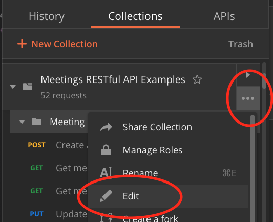
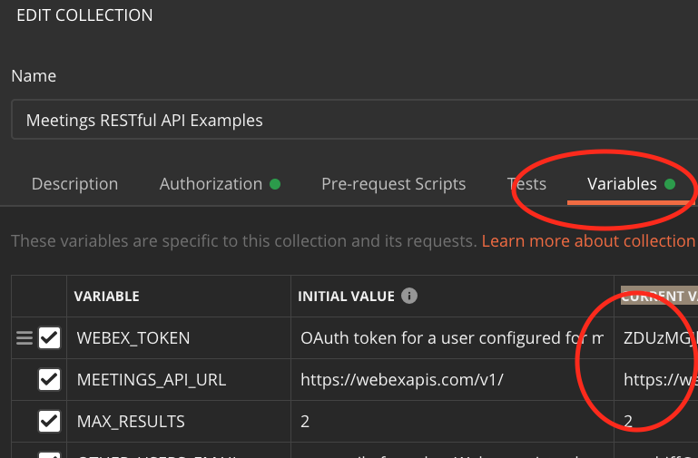
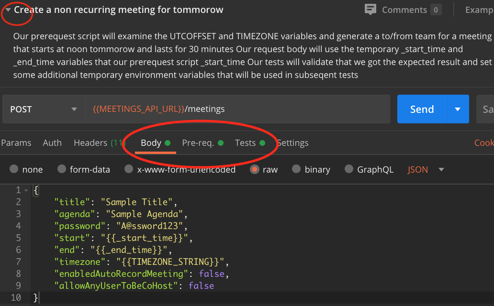
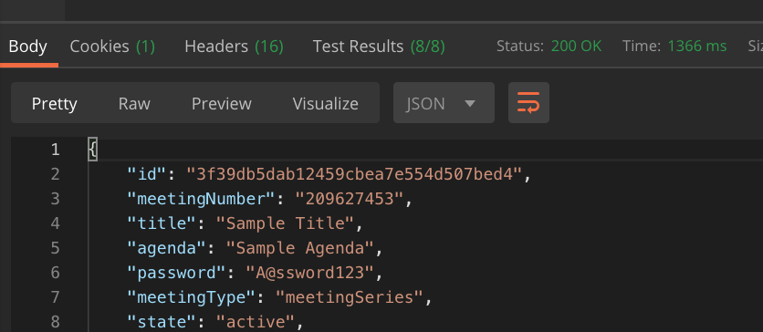

# webex-meetings-api-examples
This repo provides a Postman collection that demonstrates the use of the [Webex Meetings Rest API](https://developer.webex.com/docs/api/guides/webex-meetings-rest-api).

To excercise these API simply do the following
* [Install Postman](https://www.postman.com/downloads/)
* [Import the collection](#import-the-collection)
* [Configure the environment](#configure-the-environment)
* [Excersise the requests](#exercise-the-resquests)

## Import the collection
1) Clone this repo or simply download the [postman collection](./Meetings RESTful API Examples.postman_collection.json) to your local disk.
2) From within Postman , begin by clicking the "Import" button, and choosing the "Choose Files" button:

  

When imported succesfully you should see new collection called "Meetings RESTful API Examples in postman.

## Configure the Environment

This collection uses "collection level environment variables", which simply means that you can specify an environment unique to you directly from within the collection.   

The environment variables are: 

* WEBEX_TOKEN -- an OAuth token for a user configured for meetings in the test environment. These tests require a token with all the meetings scopes and the spark:people_read scopy.  To get started quickly, developers can copy their temporary token from the [Webex For Developers Gettings Started Guide](https://developer.webex.com/docs/api/getting-started#accounts-and-authentication)  **You must set this variable before you can try any of the requests**. 
* MEETINGS_API_URL -- the URL of the meetings API under test, generally the default value of "https://webexapis.com/v1/" does not need to be changed
* TIMEZONE_STRING -- the [Time Zone String](https://en.wikipedia.org/wiki/List_of_tz_database_time_zones) that you want your results to be returned in (ie: "America/New_York" for the US East Coast)
* UTCOFFSET - the [offset from UTC Time](https://en.wikipedia.org/wiki/List_of_tz_database_time_zones) to set your meetings (ie: "-04:00" for New York during Daylight Savings Time).   This is used by the tests pre-request scripts to create start and end time parameters that will make sense in your timezone
* MAX_RESULTS -- the max number of meetings to query for -- initially set to 2
* OTHER_USERS_EMAIL -- an email of another CI user to invite to a meeting.  This user must belong to the same org as the caller of the APIs in order for the PUT /meetingInvitees sample to work.  **You must set this environment variable before you try the requests in the /meetingInvitees folder

To edit the variables first click on the "three dots" associated with the collection and select edit

  

Then click on the "Variables" tab and update the values in the "Current Value" column as you need to:

  

If you are familar with Postman's environments, its worth noting that you don't NEED to set one to run these requests, since all the variables are set at the collection level.  If you do have an active environment that sets any of the environment variables used by this collection, the active environment variables will take precedence. 

Click the update and you are ready to try the requests.

## Excersise the requests

The collection consists of three folders that exercise the /meetings, the /meetingInvitess, and the /meetingPreferences API endpoints.   Each folder is standalone, but the requests are meant to be run one after the other.

Each request has a name and usually a description about what the request demonstrates. If the description is not visible click on the "triangle" by the request name.

  

The tabs below the request include a set of "pre request" scripts that are run before the API request is made, and a "tests" tab that runs scripts that validate the result after the request is made.   In this example, the pre-request scripts will calculate the start and end time for a meeting "tommorow at noon".  The tests scripts will validate the result.

Hit the big blue "Send" button to run the requests.

After sending the request scroll down to see the response.  The "Test Results" section will provide information on which tests passed (or failed).

  

Inspect the request and respone to better understand how the API works and move on to the next request in the folder.

The last request in each folder will run a pre-request script that will "clean up" the temporary environment variables that were set and used in the pre-request and test script.

Have fun!
